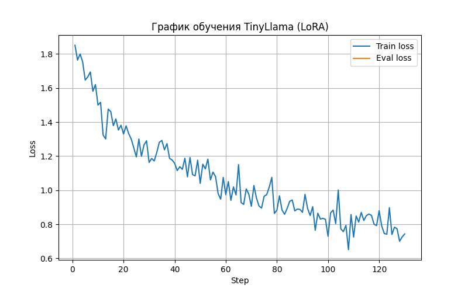

# Дообучение TinyLlama с помощью LoRA

## Цель работы -  дообучение LLM на датасете по теме хобби (Электроника)

### Проект состоит из файлов
- train.py - дообучение модели
- chat.py - запуск диалога с моделью
- dataset.csv - данные для обучения

### Запуск обучения
``` python
python .\train.py --csv_file .\dataset.csv 
```
### Запуск диалога до обучения
```python
python .\chat.py
```
### Запуск диалога после обучения
```python
python .\chat.py --use_lora
```

## 1. Используемая модель и параметры

### Базовая модель
- **Название**: `TinyLlama/TinyLlama-1.1B-Chat-v1.0`
- **Тип**: Causal Language Model (чат-ориентированная)
- **Размер**: ~1.1 млрд параметров
- **Источник**: HuggingFace Transformers

### Квантование
- Используется **4-битная загрузка** модели:
  - `load_in_4bit=True` при обучении
  - `BitsAndBytesConfig(load_in_4bit=True)` при инференсе
- Тип вычислений: `float16`

---

## 2. Параметры обучения
Из файла `train.py`
### Конфигурация LoRA
```python
lora_config = LoraConfig(
    r=16,
    lora_alpha=32,
    lora_dropout=0.05,
    target_modules=["q_proj", "k_proj", "v_proj", "o_proj"],
    bias="none",
    task_type="CAUSAL_LM",
)

model = get_peft_model(model, lora_config)
```
### Параметры обучения
```python
training_args = TrainingArguments(
    output_dir=args.output_dir,
    per_device_train_batch_size=2,
    per_device_eval_batch_size=2,
    gradient_accumulation_steps=4,
    num_train_epochs=5,
    learning_rate=2e-4,
    fp16=True,
    logging_steps=2,
    logging_first_step=True,
    save_steps=200,
    eval_strategy="steps",
    eval_steps=100,
    save_total_limit=2,
    load_best_model_at_end=True,
    report_to="none",
    optim="paged_adamw_8bit",
)
```

### Обучение модели
```python
trainer = Trainer(
    model=model,
    args=training_args,
    train_dataset=tokenized_train,
    eval_dataset=tokenized_eval,
    data_collator=collator,
)

trainer.train()
```
### График обучения

---

## 3. Данные обучения
**Источник данных**
- **Файл:** dataset.csv
- **Формат:**
  - question,answer
 
### Пример строки из датасета
Что такое резистор?,"Резистор — это пассивный компонент, ограничивающий ток в электрической цепи. Его сопротивление измеряется в омах по закону Ома: U = I × R. Используется для задания рабочих режимов, делителей напряжения, ограничения тока."
    
Каждая строка преобразуется в чат-промпт:
```
<|user|>
Вопрос</s>
<|assistant|>
Ответ</s>
```
Размер датасета 125 строк
- Разделение:
  - 80% для обучения
  - 20 для валидации

## **Примеры запросов и ответов на тему «Электроника»**
### Без использования LoRA
```
Вы: Что такое резистор?
Модель: <|user|>
Что такое резистор? 
<|assistant|>
A reactor or reactive (from the Latin root rex) is a device that can generate electricity from the heat generated by heat exchangers that contain a fluid that absorbs and reabsorbs the energy. The fluid is usually a liquid such as water or oil, and the temperature gradient inside the fluid generates the heat. The reactor is typically used in 
steam generators, where the fluid is heated by steam passing through the heater, allowing the fluid to absorb
```

```  
Вы: что такое оптопара?  

Модель: <|user|>
что такое оптопара?
<|assistant|>
Оптопара (Оптопара) — это системы, использующие оптические каналы (например, видимость колебаний в оптовом зоне) для наблюдения за движением вещей, схожих с водными опанами. В оптопаре используются специальные оптические каналы, например, светильники, что позволяет определить     
```

### С использованием LoRA
```
Вы: Что такое резистор?

Модель: <|user|>
Что такое резистор?
<|assistant|>
Резистор — это транзистор с усилителем тока, в котором заданное поколение резисторов (файлы) объехало одновременно (агрегированным транзистором). Применяется для снижения напряжения в цепях, сетях. Типы: L, N, P, H, S, R. Пример: 22050 (L)
```

```
Вы: что такое оптопара? 

Модель: <|user|>
что такое оптопара?
<|assistant|>
оптопара — это комбинация устройств для обработки информации (фоторезокатора, фотопроворактор, дискретная резонаторная антера), которые позволяют изображение оформлять изначально на дисплее, но затем декодировать на фоторезокаторе или фотопроворакторе. Используется в фотомагази
```
